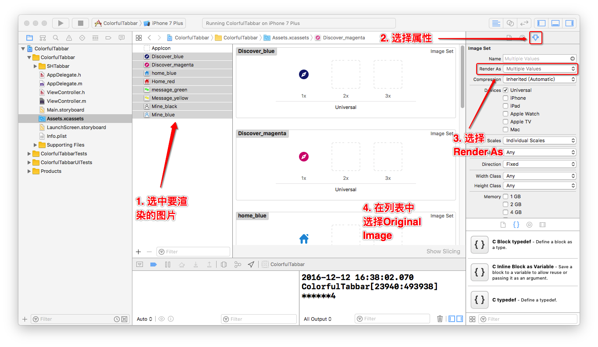

#多彩的Tabbar(iOS)

前一段时间项目有需求，在`TabbarController`不同的页面之间进行切换的时候`TabBarItem`的颜色（图标和Title）要跟着改变，所以研究了一下如何设置`TabbarItem`的颜色。

**iOS10**之后苹果新增加了一个设置颜色的API:
    tabBarController.tabBar.unselectedItemTintColor

对于只适配**iOS10**以后的APP使用这个方法可以轻松修改`TabbarItem`的颜色，但是**iOS9**及以前版本的要修改成需要的颜色还是比较麻烦，查找各种文档没有找到直接设置`TabBarItem`的`Image`颜色的方法（各位大神如果发现欢迎指正），所以现在按照以下思路来解决：

- 将`Image`的渲染模式改为`UIImageRenderingModeAlwaysOriginal`，然后设置给图标；
- 通过算法计算出图标的颜色，再设置成`Title`的颜色。

###将图片的渲染模式改为`AlwaysOriginal`可以有两种方式

1.  如下图所示：

    适用于`Storyboard`中设置图片。
2. 使用代码设置。例如：

        UIImage *image = [[UIImage new] imageWithRenderingMode:(UIImageRenderingModeAlwaysOriginal)];
        
###引入文件自动计算并设置`Title`的颜色
- 可以自定义一个类`MyTabbarItem`继承自`UITabBarItem`，并在设置`TabbarItem`的时候将`UITabBarItem`替换为自定义的类，以下为.m文件：

        #import "SHTabBarItem.h"
        @implementation SHTabBarItem
        - (instancetype)initWithCoder:(NSCoder *)aDecoder {
          if (self = [super initWithCoder:aDecoder]) {
        
          self.image = [self.image imageWithRenderingMode:UIImageRenderingModeAlwaysOriginal];
          self.selectedImage = [self.selectedImage imageWithRenderingMode:UIImageRenderingModeAlwaysOriginal];
        
          [self setTitleTextAttributes:@{NSForegroundColorAttributeName : [self mostColorWithImage:self.image]}
                            forState:UIControlStateNormal];
        
        [self setTitleTextAttributes:@{NSForegroundColorAttributeName : [self mostColorWithImage:self.selectedImage]}
                            forState:UIControlStateSelected];
           }
           return self
        }
        - (void)setImage:(UIImage *)image {
          [super setImage:image];
          [self setTitleTextAttributes:@{NSForegroundColorAttributeName : [self mostColorWithImage:self.image]}
                        forState:UIControlStateNormal];
        }
        - (void)setSelectedImage:(UIImage *)selectedImage {
           [super setSelectedImage:selectedImage];
           [self setTitleTextAttributes:@{NSForegroundColorAttributeName : [self mostColorWithImage:self.selectedImage]}
                 forState:UIControlStateSelected];
        }
        - (UIColor*)mostColorWithImage:(UIImage *)image {
        #if __IPHONE_OS_VERSION_MAX_ALLOWED > __IPHONE_6_1
           int bitmapInfo = kCGBitmapByteOrderDefault | kCGImageAlphaPremultipliedLast;
        #else
           int bitmapInfo = kCGImageAlphaPremultipliedLast;
        #endif
        // 第一步 先把图片缩小 加快计算速度. 但越小结果误差可能越大
           CGSize thumbSize = CGSizeMake(50, 50); 
           CGColorSpaceRef colorSpace =
           CGColorSpaceCreateDeviceRGB();
           CGContextRef context = CGBitmapContextCreate(NULL,
                                                 thumbSize.width,
                                                 thumbSize.height,
                                                 8,//bits per component
                                                 thumbSize.width * 4,
                                                 colorSpace,
                                                 bitmapInfo);
                                                 CGRect drawRect = CGRectMake(0, 0, thumbSize.width, thumbSize.height);
                                                 CGContextDrawImage(context, drawRect, image.CGImage);
                                                 CGColorSpaceRelease(colorSpace);    
          // 第二步 取每个点的像素值
          unsigned char* data = CGBitmapContextGetData (context);
          if (data == NULL) return nil;
          NSCountedSet *cls = [NSCountedSet setWithCapacity:thumbSize.width*thumbSize.height];
          for (NSInteger x = 0; x < thumbSize.width; x++) {
          for (NSInteger y=0; y < thumbSize.height; y++) {
            
            NSInteger offset = 4 * ( x * y );
            
            NSInteger red = data[offset];
            NSInteger green = data[offset + 1];
            NSInteger blue = data[offset + 2];
            NSInteger alpha =  data[offset + 3];
            
            if (alpha != 255) continue;
            
            NSArray *clr=@[@(red),@(green),@(blue),@(alpha)];
            [cls addObject:clr];
            
            }
        }
            CGContextRelease(context);
            // 第三步 找到出现次数最多的那个颜色
            NSEnumerator *enumerator = [cls objectEnumerator];
            NSArray *curColor = nil;
            NSArray *MaxColor=nil;
            NSUInteger MaxCount=0;
            while ( (curColor = [enumerator nextObject]) != nil ) {
            NSUInteger tmpCount = [cls countForObject:curColor];
        
            if ( tmpCount < MaxCount ) continue;
        
            MaxCount=tmpCount;
            MaxColor=curColor;
            }
            return [UIColor colorWithRed:([MaxColor[0] intValue] / 255.0f) green:([MaxColor[1] intValue] / 255.0f) blue:([MaxColor[2] intValue] / 255.0f) alpha:1.0];
        }
        @end

- 如果不想自定义可以直接下载[Demo](https://github.com/camoufleur/ColorfulTabbar)，直接拖到工程中；